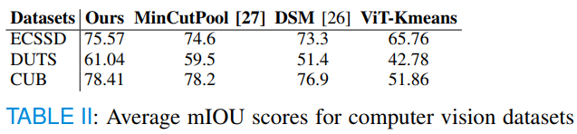

# UnSegGNet
~~Official code for the paper UnSegGNet: Unsupervised Image Segmentation using Graph Neural Networks~~

Refer to the updated version here: https://github.com/ksgr5566/UnSeGArmaNet
This repo is now archived.

# Abstract
Image segmentation, the process of partitioning an image into meaningful regions, plays a pivotal role
in computer vision and medical imaging applications. Unsupervised segmentation, particularly in the absence of
labeled data, remains a challenging task due to the interclass similarity and variations in intensity and resolution.
In this study, we extract high-level features of the input
image using pretrained vision transformer. Subsequently,
the proposed method leverages the underlying graph structures of the images, seeking to discover and delineate
meaningful boundaries using graph neural networks and
modularity based optimization criteria without relying on
pre-labeled training data. Experimental results on benchmark datasets demonstrate the effectiveness and versatility of the proposed approach, showcasing competitive
performance compared to the state-of-the-art unsupervised
segmentation methods. This research contributes to the
broader field of unsupervised medical imaging and computer vision by presenting an innovative methodology for
image segmentation that aligns with real-world challenges.
The proposed method holds promise for diverse applications, including medical imaging, remote sensing, and
object recognition, where labeled data may be scarce or unavailable. 

# Steps to set up the repository

1. Clone and cd to this repo.
2. This project uses Python 3.11 version. Run `python3 -m venv venv`.
3. If Windows:
     `.\venv\Scripts\activate`
    
   If Mac:
     `. venv/bin/activate`
4. Pip install the required torch version from [here](https://pytorch.org/). In this project we are using PyTorch 2.0 version.
5. Make the script.sh executable, run: `./script.sh`
6. Follow steps mentioned [here](/datasets/DATASETS.md) to setup the datasets and follow the below execution steps.

Note: For some reason, ECSSD (via deeplake) is not getting installed on colab. Kindly run it in another environment, if you face any issue.\
Currently in this repo, only CUB, ECSSD and DUTS are supported. Other datasets are being added soon.

# Execution:
You can run `python main.py` with the following arguments.

| Arguments      | Possible Values                                     | Default    |
|----------------|-----------------------------------------------------|------------|
| bs             | boolean                                             | False      |
| epochs         | positive int                                        | 20         |
| resolution     | two positive ints                                               | [224, 224] |
| activation | "deepcut_activation", "relu", "silu", "gelu", "selu" | "selu"     |
| loss_type      | "DMON", "NCUT"                                      | "DMON"     |
| process        | "KMEANS_DINO", "DINO", "MEDSAM_INFERENCE" | "DINO"     |
| dataset        | "CUB", "ECSSD", "DUTS"                                     | "ECSSD"    |
| threshold      | float                                               | 0          |
| conv_type      | "GCN"                                       | "GCN"     |

Example call:\
`python main.py --dataset "ECSSD" --threshold 0.1 --bs False --epochs 20 --resolution 224 224 --activation "selu" --loss_type "DMON" --process "DINO" --conv_type "GCN"`

# Visualizations

# Results

# Acknowledgements
We extend our heartfelt gratitude to the creators and contributors of [Deepcut](https://github.com/SAMPL-Weizmann/DeepCut) which laid the foundation for our code, which is licensed under the [MIT License](https://github.com/SAMPL-Weizmann/DeepCut/blob/main/LICENSE.txt).
